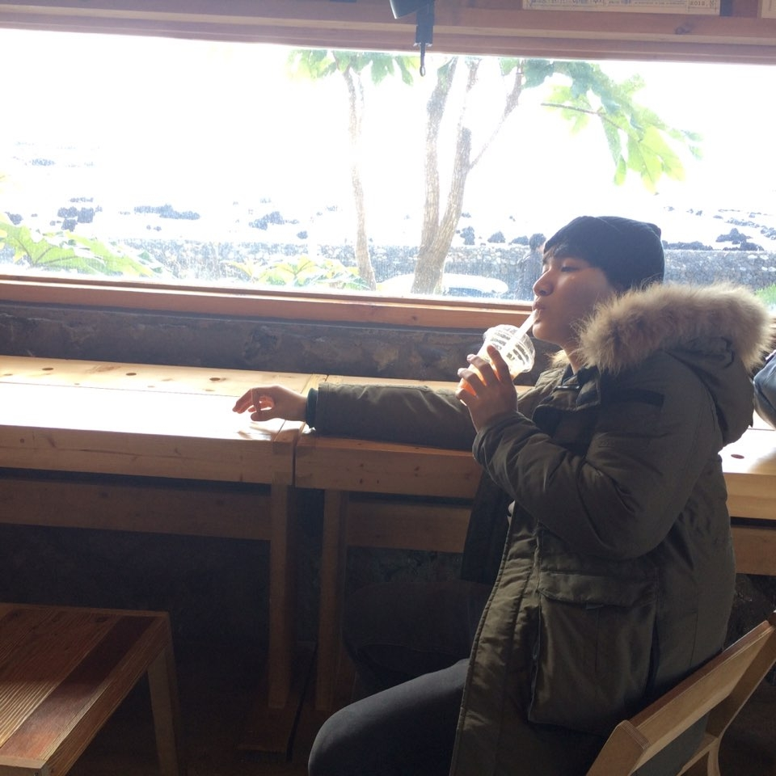

# Yunseong Lee

Computer Scientist, Software Developer.

## {: width="100" height="100"}

[swack9751@naver.com](swack9751@naver.com)
| [Blog](https://alohays.github.io)

## Currently

I am not only an optimist but also an optimizer

### Specialized in

- Machine Learning, Computer Vision
- Algorithms, Problem Solving
- Presentation, Teaching

### Skills

- C, C++, Java, Python ...
- English, Korean

### Research interests

Machine Learning, Computer Vision, Algorithms, Optimizations, Artificial Intelligence, Quantum Algorithms. 

## Education

`2019-`
__Korea Univ. [DAVIAN LAB](http://davian.korea.ac.kr/)__

- M.Sc. (Computer Science Engineering) 

`2014-2019`
__HanYang Univ.__

- B.Sc. (Computer Science Engineering) 

## Awards

`2016`
UCPC 28th place, *Union of Korean Programming Contest Team*, Seoul, Korea

`2015`
4th place, *HYU Programming Contest  (Advanced Division)*, Seoul, Korea

`2014`
ACM-ICPC Regional Award, *ACM*, *HYU CSE*, Daejeon, Korea

## Experiences

`2018`
Undergraduate Research Assistant of  [KU DAVIAN LAB](http://davian.korea.ac.kr/), Seoul, Korea

`2018`
Undergraduate Deep Learning Study Group Member of  [HYU CVLAB](http://cvlab.hanyang.ac.kr/), Seoul, Korea

`2017`
[Advanced Algorithms and Complexity Study Note in Korean](https://wikidocs.net/book/1469) Co-author

`2017`
Trainee, SW  Maestro, Ministry of Science and ICT, Seoul, Korea

`2017`
Intern, [Algorithm Labs (HY-WEP)](https://www.algorithmlabs.co.kr/), Seoul,Korea

`2018`
Experience Catalyst, 14th [TEDxHanyangU Organizers](http://tedxhanyangu.org/), Seoul, Korea

`2017`
Web Engineer, 13th [TEDxHanyangU Organizers](http://tedxhanyangu.org/), Seoul, Korea

`2015-2016`
Team Leader, [ALOHA (Algorithm research team of HYU)](https://www.facebook.com/HYUALOHA/), Seoul, Korea

- Accomplishments
    - Team’s accomplishments: UCPC(3rd), ACM-ICPC Daejeon(Bronze medal), Google Code Jam for Women(21st)
    - Hosted several programming contests
    - Open combined event: KSH(Korea, Sookmyung W, Hanyang Univ.) Algorithm Camp - Test writer & Presenter
    - Taught algorithms to team members

`2016`
Chief test writer, HYU Programming Contest, Seoul, Korea

## Accomplishments

`2017`
Certifications, Advanced Algorithms and Complexity Data Structures, [Coursera](https://www.coursera.org/)

<!-- ### Footer

Last updated: Jun 2018 -->

